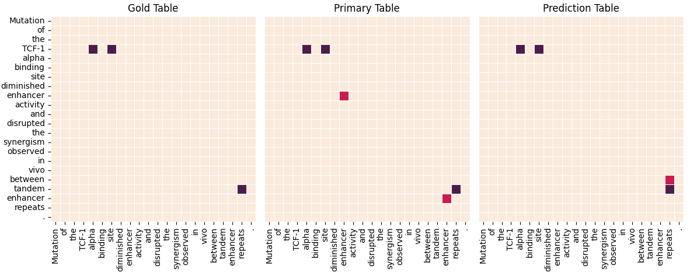

# TFNER
a unified framework for flat and nested named entity recognition based on table filling

## Setup conda enviroment

- pip install transformers==4.17.0</br>
- pip install bert4keras==0.11.0</br>
- pip install tensorflow==2.2<br>
- conda install pytorch==1.8.0 torchvision==0.9.0 torchaudio==0.8.0 cudatoolkit=11.1 -c pytorch -c conda-forge</br>

## How to use
```bash
git clone git@github.com:cjymz886/TFNER.git
cd TFNER
python run.py --mode train --config_name genia
```

## Prediction Mode and Primary Mode
The comparison of prediction mode and primary mode:

